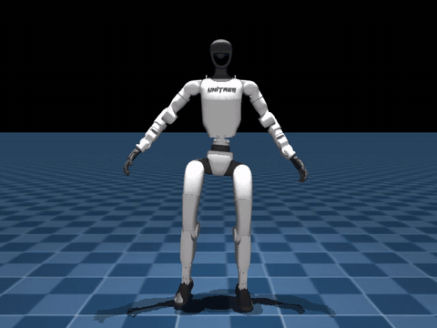
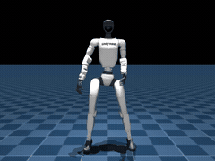
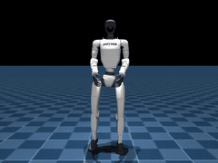

<p align="center">
  
</p>

# G1 Moves

Motion capture clips for the Unitree G1 humanoid robot, captured with Movin Studio and exported as BVH and FBX.

## Credits

**Director:** [Mitch Chaiet](https://mitchchaiet.com/)
**DIT:** [Molly Maguire](https://www.linkedin.com/in/mollymaguire001/)
**Dance:** [Jasmine Coro](https://jasminecoro.com/)
**Karate:** [Mike Gassaway](https://www.backstage.com/u/mike-gassaway/)

## Structure

```
dance/          28 clips — dance routines
karate/         27 clips — karate/martial arts moves
bonus/           4 clips — fencing, hands-up, chops
movin-studio-project/   Raw Movin Studio recordings and project file
```

Each clip lives in its own subfolder containing:

| File | Format |
|------|--------|
| `<clip>.bvh` | BVH motion capture (humanoid skeleton, Hips root) |
| `<clip>.pkl` | Retargeted G1 joint trajectories (29 DOF) |
| `<clip>_bl.fbx` | FBX for Blender |
| `<clip>_mb.fbx` | FBX for Maya |
| `<clip>_ue.fbx` | FBX for Unreal Engine |
| `<clip>_un.fbx` | FBX for Unity |

## Retarget

All 59 BVH clips have been retargeted to the Unitree G1 (mode 15, 29 DOF) using [movin_sdk_python](https://github.com/MOVIN3D/movin_sdk_python). The pipeline:

1. **BVH → IK**: Per-frame inverse kinematics maps human skeleton to G1 joint limits (1.75m human height)
2. **Ground calibration**: MuJoCo forward kinematics finds minimum foot Z across all frames, shifts root down for ground contact
3. **PKL output**: `{fps, root_pos, root_rot, dof_pos}` — 60 FPS, quaternions in xyzw order, 29 joint angles
4. **Video render**: MuJoCo offscreen 1080x1080, libx264 CRF 18

Run `python retarget_all.py` to regenerate (skips existing outputs).

## Equipment

### Motion Capture

All 59 clips were captured using the [MOVIN TRACIN](https://movin3d.com/) markerless motion capture system from [MOVIN3D](https://movin3d.com/). MOVIN TRACIN uses on-device AI to fuse LiDAR point clouds and vision into production-ready motion data — no markers, no suit, no multi-camera rig. Captured performances were recorded and exported using [MOVIN Studio](https://www.movin3d.com/studio), which provides real-time skeleton visualization, recording management, and export to BVH and FBX formats. Retargeting from human skeleton to G1 robot joint space was performed using [movin_sdk_python](https://github.com/MOVIN3D/movin_sdk_python).

Thank you to [MOVIN3D](https://movin3d.com/) for building an incredible motion capture platform that makes professional-grade mocap accessible to robotics researchers.

### Workstation

All data was captured and policies were trained on a [Dell Pro Max Tower T2](https://creatorfolio.co/mitchbookpro) workstation from [Dell Technologies](https://www.dell.com/):

| Component | Spec |
|-----------|------|
| CPU | Intel Core Ultra 9 285K (24 cores, up to 7.2 GHz) |
| GPU | NVIDIA RTX PRO 6000 Blackwell Workstation Edition (96 GB GDDR7) |
| RAM | 128 GB DDR5 |
| Storage | 2x 4 TB WD SN8000S NVMe SSD (8 TB total) |
| OS | Ubuntu 24.04 LTS |

The RTX PRO 6000 Blackwell with 96 GB of VRAM enables running thousands of parallel MuJoCo-Warp simulation environments on a single GPU for reinforcement learning training, while the 24-core Ultra 9 285K handles motion retargeting and data processing. Thank you to [Dell Technologies](https://www.dell.com/) for providing the compute power behind this project.

## Clips

### Dance (28)

| Mocap | Retarget | Training |
|-------|----------|----------|
| **B_DadDance** | | |
|  |  |  |
| **B_LongDance** | | |
|  |  |  |
| **B_SpiralDance** | | |
|  |  |  |
| **B_StretchDance** | | |
|  |  |  |
| **B_WiggleDance** | | |
|  |  |  |
| **J_Dance0_StepTouch** | | |
|  |  |  |
| **J_Dance1_Modern** | | |
|  |  |  |
| **J_Dance2_Salsa** | | |
|  |  |  |
| **J_Dance3_Woah** | | |
|  |  |  |
| **J_Dance4_Broadway** | | |
|  |  |  |
| **J_Dance5_Hype** | | |
|  |  |  |
| **J_Dance6_Sassy** | | |
|  |  |  |
| **J_Dance7_Party** | | |
|  |  |  |
| **J_Dance8_WestCoast** | | |
|  |  |  |
| **J_Dance9_PeaceMaker** | | |
|  |  |  |
| **J_Dance11_Gnarly** | | |
|  |  |  |
| **J_Dance12_LushLife** | | |
|  |  |  |
| **J_Dance17_Shuffle** | | |
|  |  |  |
| **J_Dance18_TikTok** | | |
|  |  |  |
| **J_Dance19_LetsGO** | | |
|  |  |  |
| **J_Dance20_DWG** | | |
|  |  |  |
| **J_Dance21_Blunt** | | |
|  |  |  |
| **J_Dance22_Thrilling** | | |
|  |  |  |
| **J_Dance23_MidnightSun** | | |
|  |  |  |
| **J_ShortDance13_SingleLadies** | | |
|  |  |  |
| **J_ShortDance14_Disco** | | |
|  |  |  |
| **J_ShortDance15_Nineties** | | |
|  |  |  |
| **J_ShortDance16_JazzWalk** | | |
|  |  |  |

### Karate (27)

| Mocap | Retarget | Training |
|-------|----------|----------|
| **B_AttackKarate** | | |
|  |  |  |
| **B_BowKarate** | | |
|  |  |  |
| **B_ChopsKarate** | | |
|  |  |  |
| **B_CrazyChopsKarate** | | |
|  |  |  |
| **B_ForwardKarate** | | |
|  |  |  |
| **B_LongKarate** | | |
|  |  |  |
| **B_SpinKarate** | | |
|  |  |  |
| **M_Move1** | | |
|  |  |  |
| **M_Move2** | | |
|  |  |  |
| **M_Move3** | | |
|  |  |  |
| **M_Move4** | | |
|  |  |  |
| **M_Move5** | | |
|  |  |  |
| **M_Move6** | | |
|  |  |  |
| **M_Move7** | | |
|  |  |  |
| **M_Move8** | | |
|  |  |  |
| **M_Move9** | | |
|  |  |  |
| **M_Move10** | | |
|  |  |  |
| **M_Move11** | | |
|  |  |  |
| **M_Move17** | | |
|  |  |  |
| **M_Move18** | | |
|  |  |  |
| **M_Move19** | | |
|  |  |  |
| **M_Move20** | | |
|  |  |  |
| **M_ShortMove12** | | |
|  |  |  |
| **M_ShortMove13** | | |
|  |  |  |
| **M_ShortMove14** | | |
|  |  |  |
| **M_ShortMove15** | | |
|  |  |  |
| **M_ShortMove16** | | |
|  |  |  |

### Bonus (4)

| Mocap | Retarget | Training |
|-------|----------|----------|
| **B_Fence1** | | |
|  |  |  |
| **B_Fence2** | | |
|  |  |  |
| **B_HandsChop** | | |
|  |  |  |
| **B_HandsUp** | | |
|  |  |  |

## Capture Details

- **Skeleton**: Humanoid, Hips root, 6-DOF root channels, 3-DOF joint rotations (YXZ)
- **Export formats**: BVH + 4 FBX variants (Blender, Maya, Unreal, Unity)
